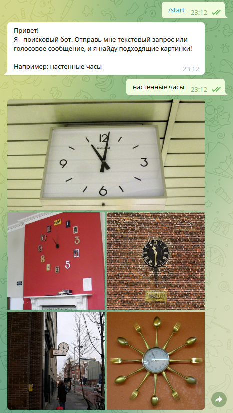

# Проектирование [Telegram bot](https://t.me/hse11_design_bot)

<p align="center">

</p>

## Запуск

Требования
* Python 3.7+

Установка:
```
./setup.sh
```

Загрузка данных:
```
./load_data.sh
```

Предобработка данных:
```
python precalc_embeds.py --data_path data/image_dataset --embeds_path data/embeds.npz
```

Перед запуском в папке ```data``` создайте файл ```token.txt``` и положите в него токен своего бота
```
touch data/token.txt
echo "YOUR TOKEN" > token.txt
```

Запуск
```
python run.py --token_path data/token.txt --start_text_path data/start_text.txt --embeds_path data/embeds.npz
```

## Описание

Это бот для поиска изображений. Он умеет отвечать на текстовые и голосовые сообщения. Бот принимает запрос и находит наиболее подходящие изображения.

Логика работы следующая. Перед началом работы происходит индексация базы данных. Для всех изображений строятся их векторные представления. Затем, непосредственно перед началом работы, векторные представления складываются в базу данных. Далее бот получает запросы, текстовые или аудио. Во втором случае речь распознается и дальше обрабатывается как текст. Если на вход боту пришел русский текст, он переводится на английский. Далее строится векторное представление текста и затем по векторному представлению ищются ближайшие изображения.

В качестве базы изображений используется датасет [MS COCO 2017](https://cocodataset.org/#home).

Для распознавания речи используется модель [Wav2Vec2-Large](https://github.com/jonatasgrosman/asrecognition).

Так как доступные модели сопоставления текстов и изображений работают лучше для английского языка, для русскоязычных запросов я использую модель перевода с русского на английский [M2M100](https://huggingface.co/facebook/m2m100_418M).

Для построения векторных представлений изображений и текстов используется модель [CLIP](https://github.com/openai/CLIP).

Для поиска ближайших векторов по косинусной близости используется база данных для векторных представлений [FAISS](https://github.com/facebookresearch/faiss).
